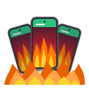
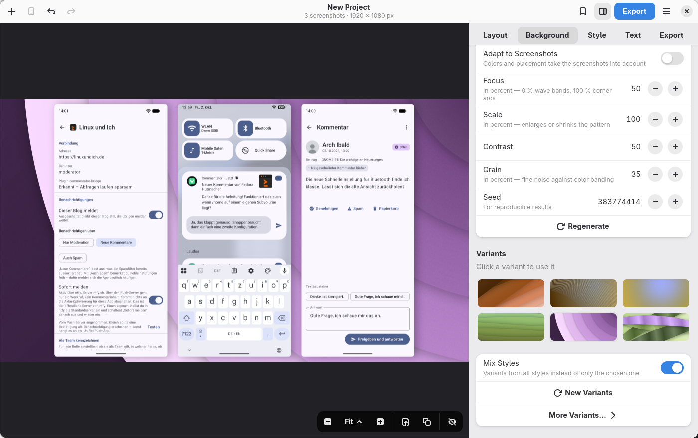
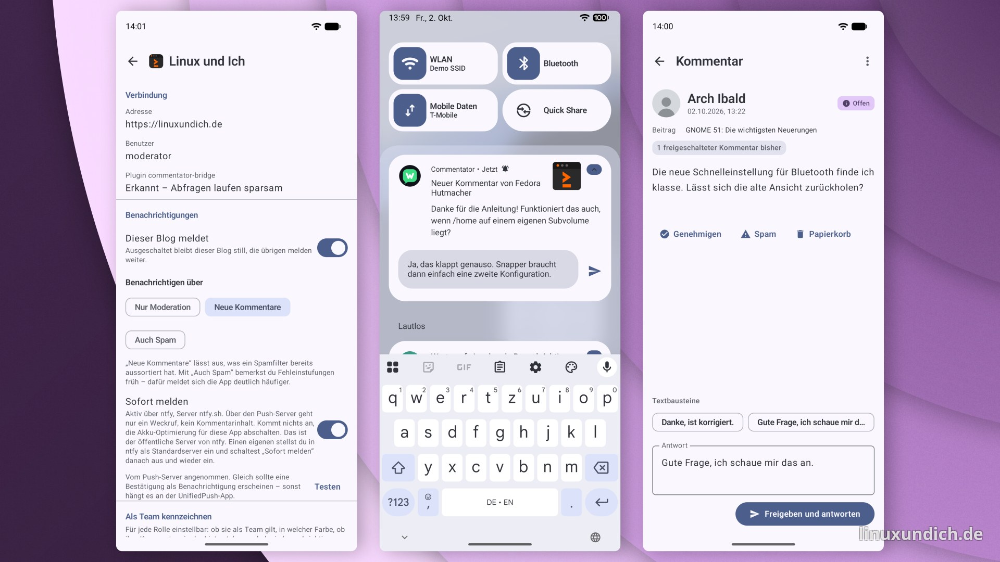
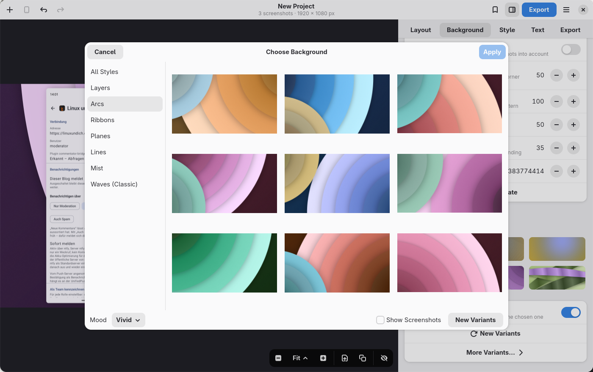
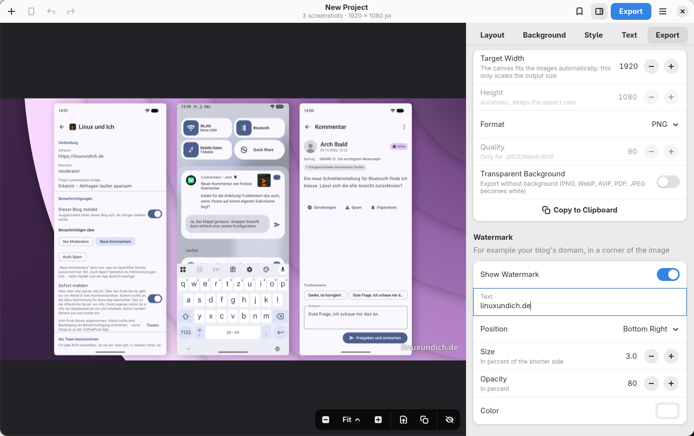

  

<h1 align="center">ScreenForge</h1>

<strong>Your screenshots, ready to show.</strong>

  Put several smartphone screenshots side by side on one image, on a background that looks designed,
  ready for a blog post, a store listing or social media. A native GTK&nbsp;4 and libadwaita app that works entirely offline.

  <a href="docs/DEVELOPMENT.md#flatpak"><strong>Build the Flatpak</strong></a>
  &nbsp;·&nbsp; Flathub: planned &nbsp;·&nbsp;
  <a href="CHANGELOG.md">Changelog</a>

  

## What it does

### Screenshots in, presentation image out

Drop in a few screenshots, paste them from the clipboard or take them straight from your Android phone. ScreenForge lines them up, scales them to a common size and adds shadows and rounded corners. Horizontal, vertical, grid, or free placement with snapping and alignment tools.

  

### Backgrounds that look designed

The background generator draws abstract scenes in six styles: layered paper, concentric arcs, silk ribbons, folded planes, line bundles and soft mist. Colors come in harmonious palettes, vivid, light or dark, or taken from your screenshots. Don't like it? The sidebar always offers six variants, and the background studio shows nine large previews of your actual composition. Plain colors, gradients, your own image or a blurred copy of a screenshot work too.

  

### Phones, tablets, browsers, in perspective

Put each screenshot into a generic phone with a punch-hole camera, a tablet or a browser window, dark or light. Turn and lean them in real perspective, or fan them out so the outer ones face the middle.

### Point things out, hide what's private

Give each screenshot a label, add callouts with arrows that point at a detail, and black out, pixelate or blur e-mail addresses and other private bits before you share.

### The right size for every place

Keep the canvas fitted to the content or pick a format: 16:9, square, 4:5, story, Open Graph, Mastodon and Bluesky, the Play Store feature graphic or App Store sizes. Your content stays centered and is never cropped. Split a composition into several images with one continuous background for app store panoramas, or export a short animated WebM in which the screenshots fly in. Add a watermark, export as PNG, JPEG, WebP, AVIF or PDF, with a transparent background if you like, or copy the result to the clipboard and drag it straight into a browser or chat.

  

### At home on GNOME

Adaptive layout, a tabbed sidebar, keyboard shortcuts and undo for every edit. Open images from the file manager, take a desktop screenshot through the system dialog, or import from an Android device over adb, with a clean status bar showing 12:00 and a full battery. Save projects as single `.screenforge` files and reuse your look as presets, also from the command line: `screenforge --preset Blog --output shots.png *.png`. English and German included.

## Install

ScreenForge isn't on Flathub yet. You can build and install the Flatpak from this repository with one script, or build it with meson; see [docs/DEVELOPMENT.md](docs/DEVELOPMENT.md).

## Translations

The interface is translated with gettext. German is complete; [po/README.md](po/README.md) explains how to add another language.

## License

[GPL-3.0-or-later](LICENSE)
